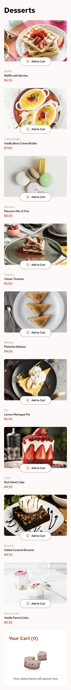
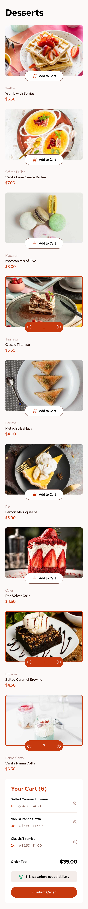
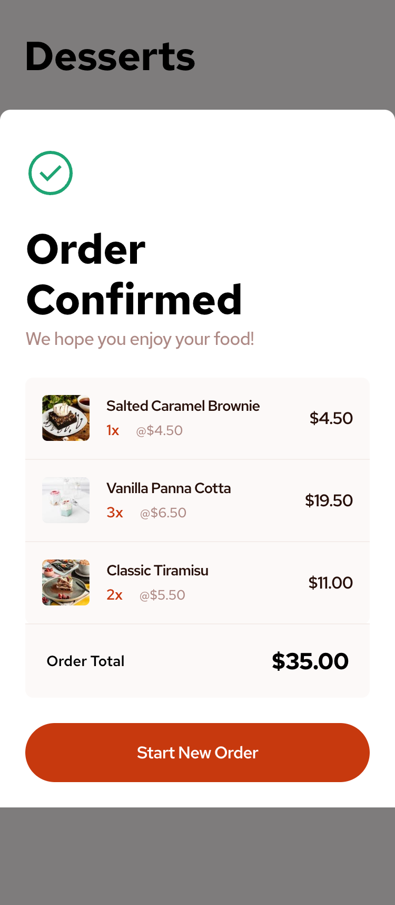
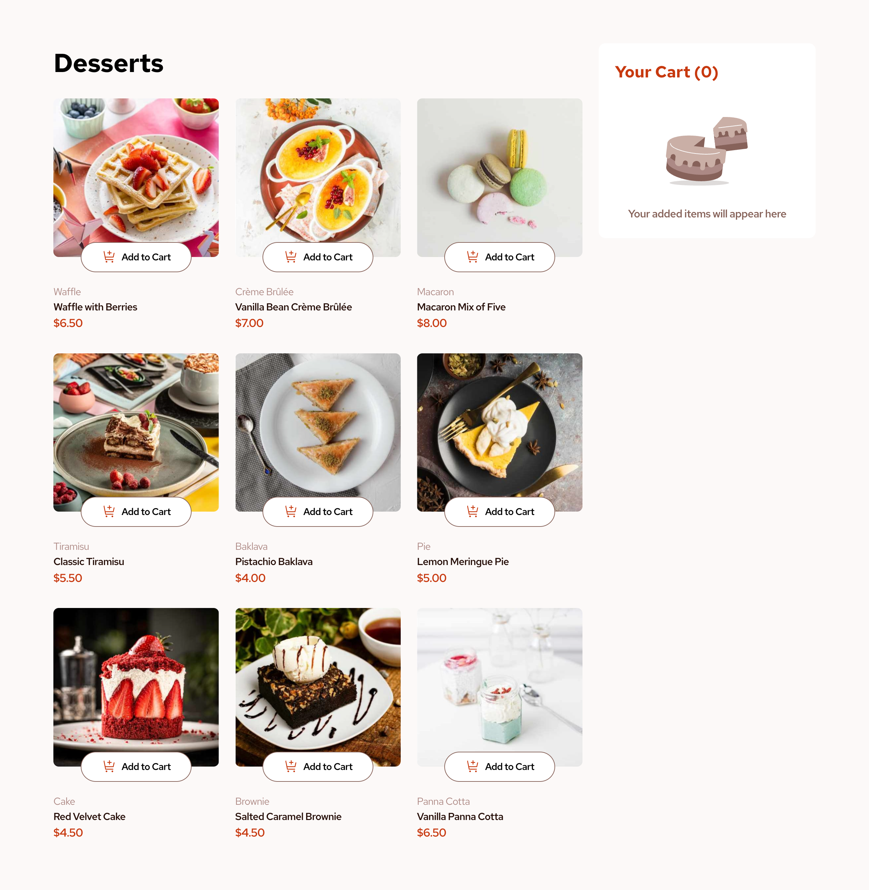
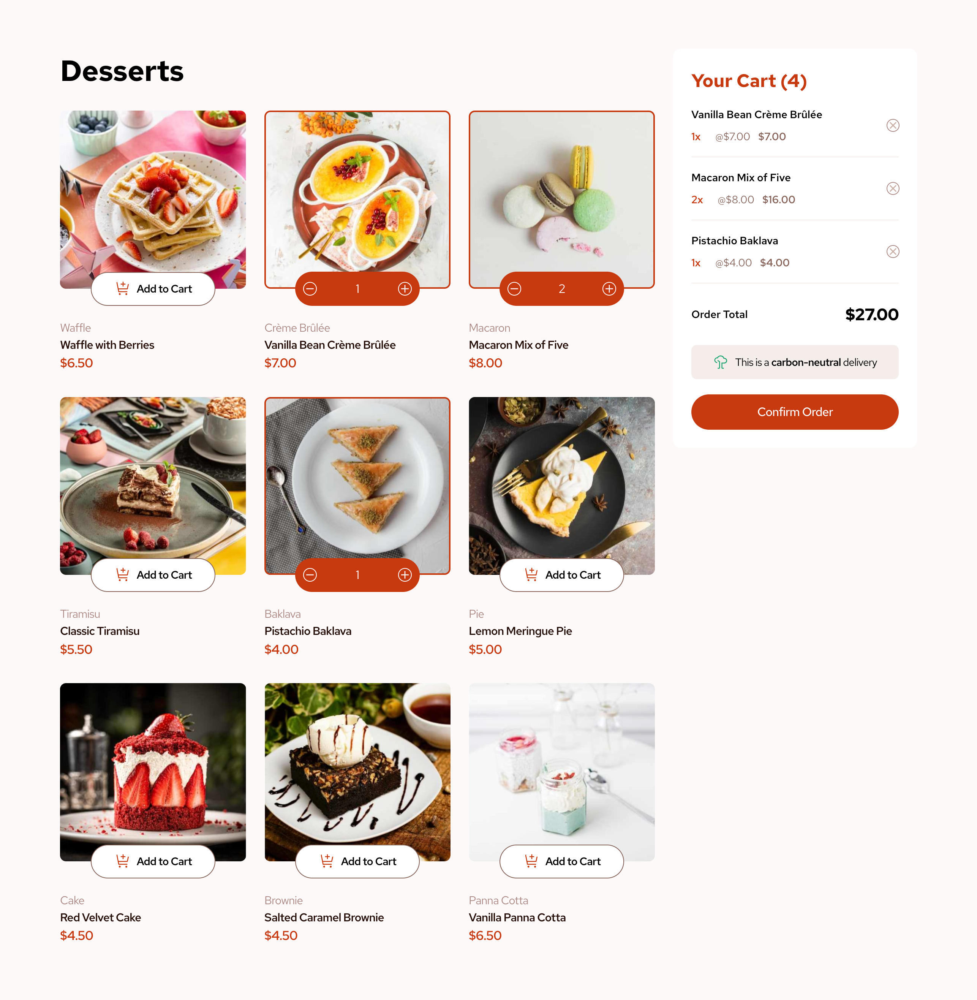
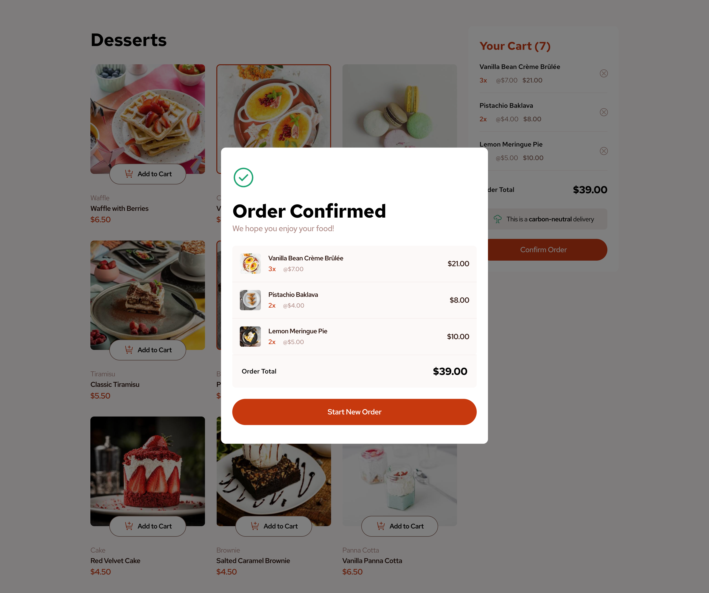

# Frontend Mentor - Product list with cart solution

This is a solution to the [Product list with cart challenge on Frontend Mentor](https://www.frontendmentor.io/challenges/product-list-with-cart-5MmqLVAp_d). Frontend Mentor challenges help you improve your coding skills by building realistic projects. 

## Table of contents

- [Overview](#overview)
  - [The challenge](#the-challenge)
  - [Screenshot](#screenshot)
  - [Links](#links)
- [My process](#my-process)
  - [Built with](#built-with)
  - [What I learned](#what-i-learned)
  - [Continued development](#continued-development)
  - [Useful resources](#useful-resources)
- [Author](#author)
- [Acknowledgments](#acknowledgments)

**Note: Delete this note and update the table of contents based on what sections you keep.**

## Overview

### The challenge

Users should be able to:

- Add items to the cart and remove them
- Increase/decrease the number of items in the cart
- See an order confirmation modal when they click "Confirm Order"
- Reset their selections when they click "Start New Order"
- View the optimal layout for the interface depending on their device's screen size
- See hover and focus states for all interactive elements on the page

### Screenshot
#### My solution:

<table>
  <tr>
    <td># mobile empty</td>
    <td># mobile selected</td>
    <td># mobile confirmed</td>
  </tr>
  <tr>
    <td></td>
    <td></td>
    <td></td>
  </tr>
</table>

  

<table>
  <tr>
    <td># desktop empty</td>
    <td># desktop selected</td>
  </tr>
  <tr>
    <td></td>
    <td></td>
  </tr>
  <tr>
     <td># desktop confirmed</td>
  </tr>
  <tr>
    <td></td>
  </tr>
</table>

- Solution URL: [Add solution URL here](https://your-solution-url.com)
- Live Site URL: [Add live site URL here](https://your-live-site-url.com)

## My process

### Built with

- Semantic HTML5 markup
- CSS custom properties
- Flexbox
- CSS Grid
- Mobile-first workflow

### What I learned
This project was good opportunity for practicing manipulation of html elements in javascript. 
I structured my code to update data in array and variables first using functions, 
then store them to local storage, following with rendering updated data to HTML. 
All starting with targeted click event.

- fetching data from json file
- Click event DOM manipulation
- setters and getters functions
- callback functions
- HTML picture element with control of images size depends on screen size
- using localStorage to store data

### Continued development

Continue in my path to develope frontEnd coding skills completing another project.

### Useful resources
I would like to thank to Josh Comeau for his CSS reset I use: https://www.joshwcomeau.com/css/custom-css-reset/

## Author

- Frontend Mentor - [Mario.H](https://www.frontendmentor.io/profile/sportif7)

